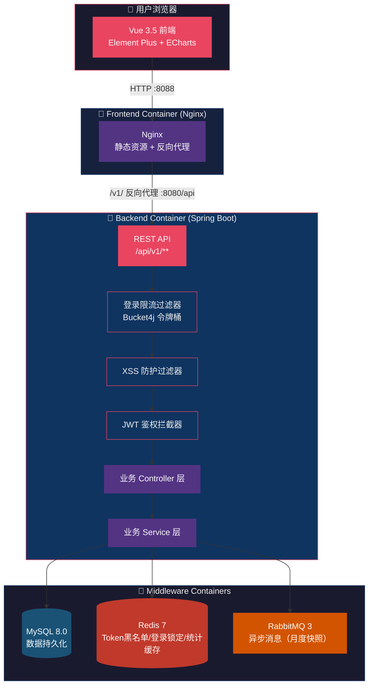
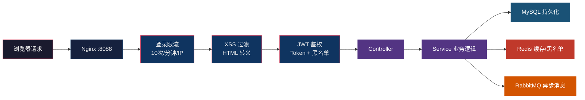

# Coinly - 轻量级个人记账应用

> 一个基于 Spring Boot 3.4 + Vue 3.5 的全栈个人记账应用，支持多账本管理、分类记账、统计报表、预算管控，Docker 一键部署。

---

## 目录

- [技术架构](#技术架构)
- [功能列表](#功能列表)
- [技术栈](#技术栈)
- [项目目录结构](#项目目录结构)
- [快速启动](#快速启动)
- [Docker 部署](#docker-部署)
- [API 接口概览](#api-接口概览)
- [环境变量说明](#环境变量说明)
- [版本历程](#版本历程)

---

## 技术架构



**请求链路说明：**



---

## 功能列表

| 模块 | 功能 | 说明 |
|------|------|------|
| 注册/登录 | 用户注册 | 用户名唯一校验、BCrypt 密码加密、注册即创建默认账本和分类 |
| | 用户登录 | JWT Token 认证、7 天有效期、注册成功直接返回 Token |
| | 退出登录 | Token 加入 Redis 黑名单，立即失效 |
| | 登录限流 | 每 IP 每分钟最多 10 次登录请求（Bucket4j 令牌桶） |
| | 账号锁定 | 连续失败 5 次锁定 15 分钟 |
| 账本管理 | 账本 CRUD | 创建/列表/详情/编辑/删除，删除前检查关联交易 |
| 分类管理 | 默认分类初始化 | 注册时自动复制 48 条默认分类（12 一级 + 36 二级） |
| | 分类 CRUD | 一级/二级分类的新增/编辑/删除，删除前检查关联交易 |
| 交易记账 | 交易 CRUD | 新增/编辑/删除/详情，支持支出/收入两种类型 |
| | 分页查询 | 按类型/分类/日期范围筛选，分页返回 |
| | CSV 导出 | 前端生成 CSV 文件下载 |
| 统计报表 | 月度收支总览 | 按月统计收入/支出/结余 |
| | 分类支出占比 | 按分类汇总支出金额及占比 |
| | 年度收支趋势 | 按月展示全年收支趋势 |
| | 近 6 月趋势 | 支持跨年的近 N 月收支趋势 |
| | 账本余额汇总 | 各账本总收入/总支出/余额 |
| 预算管理 | 预算 CRUD | 设置/修改/删除预算，支持总预算和分类预算 |
| | 使用率计算 | 实时计算预算使用率 |
| | 超支标记 | 支出超过预算自动标记 |
| 个人信息 | 查看信息 | 查看用户名/昵称/邮箱 |
| | 修改信息 | 修改昵称/邮箱 |
| | 修改密码 | 校验旧密码后修改新密码 |
| Docker 部署 | 一键启动 | docker-compose 一键启动全栈服务 |
| | 健康检查 | 全服务 healthcheck 配置 |
| | 数据持久化 | MySQL/Redis/RabbitMQ 数据卷持久化 |

---

## 技术栈

### 后端

| 技术 | 版本 | 用途 |
|------|------|------|
| Java | 17 | 运行时 |
| Spring Boot | 3.4.7 | Web 框架 |
| Spring Security | 6.x | 安全框架（密码加密/会话管理） |
| MyBatis-Plus | 3.5.7 | ORM 框架 |
| MySQL | 8.0 | 关系型数据库 |
| Redis | 7 | 缓存/Token 黑名单/登录锁定 |
| RabbitMQ | 3 | 异步消息队列 |
| Bucket4j | 8.10.1 | 令牌桶限流 |
| JWT (jjwt) | 0.12.5 | Token 认证 |
| Knife4j | 4.5.0 | API 文档 |
| Actuator | - | 健康检查/监控 |
| Lombok | - | 简化样板代码 |

### 前端

| 技术 | 版本 | 用途 |
|------|------|------|
| Vue | 3.5 | 前端框架 |
| TypeScript | 5.6 | 类型安全 |
| Vite | 8.0 | 构建工具 |
| Element Plus | 2.8 | UI 组件库 |
| ECharts | 6.0 | 图表可视化 |
| Pinia | 2.2 | 状态管理 |
| Vue Router | 4.4 | 路由管理 |
| Axios | 1.7 | HTTP 请求 |

### 基础设施

| 技术 | 用途 |
|------|------|
| Docker | 容器化部署 |
| Docker Compose | 多容器编排 |
| Nginx | 前端静态服务 + API 反向代理 |
| Maven | 后端依赖管理/构建 |
| pnpm/npm | 前端依赖管理/构建 |

---

## 项目目录结构

```
Coinly/
├── docker-compose.yml              # 全栈 Docker 编排配置
├── .env.example                    # 环境变量模板
├── README.md                       # 项目说明文档
│
├── backend-java/                   # 后端工程（Maven 多模块）
│   ├── pom.xml                     # 父 POM
│   ├── Dockerfile                  # 后端 Docker 镜像构建（多阶段）
│   ├── docs/
│   │   └── schema.sql              # 数据库初始化脚本（建表 + 默认分类）
│   │
│   ├── coinly-common/              # 公共模块
│   │   └── src/main/java/com/coinly/common/
│   │       ├── context/            # 用户上下文（ThreadLocal）
│   │       ├── domain/             # 统一响应体（CommonResponse/PageResponse）
│   │       ├── exception/          # 全局异常处理
│   │       ├── logging/            # 日志脱敏转换器
│   │       └── util/               # JWT 工具类
│   │
│   ├── coinly-integration/         # 集成模块（预留扩展）
│   │
│   ├── coinly-business/            # 业务模块
│   │   └── src/main/java/com/coinly/business/
│   │       ├── auth/               # 认证（Controller/拦截器/Security配置）
│   │       ├── user/               # 用户（个人信息/密码修改）
│   │       ├── book/               # 账本管理
│   │       ├── category/           # 分类管理
│   │       ├── transaction/        # 交易记账
│   │       ├── statistics/         # 统计报表
│   │       ├── budget/             # 预算管理
│   │       ├── cache/              # Redis 缓存服务
│   │       ├── mq/                 # RabbitMQ 消息生产/消费
│   │       └── security/           # 安全（限流/登录锁定/XSS防护）
│   │
│   └── coinly-system/              # 系统模块（启动入口/配置）
│       └── src/main/
│           ├── java/com/coinly/config/   # WebMvc/MyBatis/Knife4j 配置
│           └── resources/
│               ├── application-dev.yml    # 开发环境配置
│               ├── application-docker.yml # Docker 环境配置
│               ├── application-prod.yml   # 生产环境配置
│               └── logback-spring.xml     # 日志配置（脱敏 + 滚动）
│
└── frontend-vue/                   # 前端工程
    ├── package.json
    ├── Dockerfile                  # 前端 Docker 镜像构建（多阶段）
    ├── nginx.conf                  # Nginx 配置（静态 + 反代）
    ├── vite.config.ts              # Vite 构建配置
    └── src/
        ├── main.ts                 # 应用入口
        ├── App.vue                 # 根组件
        ├── router/index.ts         # 路由配置（含守卫）
        ├── stores/user.ts          # 用户状态管理（Pinia）
        ├── utils/request.ts        # Axios 请求封装
        ├── layout/MainLayout.vue   # 主布局（侧边栏 + 顶栏）
        └── views/
            ├── auth/               # 登录/注册页面
            ├── dashboard/          # 仪表盘
            ├── book/               # 账本管理
            ├── transaction/        # 交易列表
            ├── category/           # 分类管理
            ├── statistics/         # 统计报表
            ├── budget/             # 预算管理
            ├── user/               # 个人信息/修改密码
            └── NotFoundView.vue    # 404 页面
```

---

## 快速启动

### 方式一：Docker 一键启动（推荐）

> 前提：已安装 Docker 和 Docker Compose

```bash
# 1. 进入项目根目录
cd d:\project\Coinly

# 2. （可选）复制环境变量文件并修改配置
cp .env.example .env

# 3. 一键构建并启动全部服务
docker-compose up -d --build

# 4. 查看服务状态
docker-compose ps

# 5. 查看日志
docker-compose logs -f backend
```

启动完成后：
- 前端访问地址：http://localhost:8088
- 后端 API 地址：http://localhost:8080/api
- API 文档（Knife4j）：http://localhost:8080/api/swagger-ui.html
- RabbitMQ 管理台：http://localhost:15672（guest/guest）

### 方式二：本地开发

#### 1. 启动中间件

使用 Docker 快速启动 MySQL、Redis、RabbitMQ：

```bash
# 仅启动中间件（MySQL映射到3307，避免本地冲突）
docker-compose up -d mysql redis rabbitmq
```

或使用本地安装的中间件，确保以下端口可用：
- MySQL: 3306
- Redis: 6379
- RabbitMQ: 5672

#### 2. 初始化数据库

```bash
mysql -u root -p < backend-java/docs/schema.sql
```

#### 3. 启动后端

```bash
cd backend-java

# 编译
mvn clean package -DskipTests

# 运行（开发环境）
java -jar coinly-system/target/*.jar --spring.profiles.active=dev
```

后端启动后访问 http://localhost:8080/api

#### 4. 启动前端

```bash
cd frontend-vue

# 安装依赖
npm install

# 启动开发服务器
npm run dev
```

前端启动后访问 http://localhost:5173

---

## Docker 部署

### 服务端口映射

| 服务 | 容器端口 | 宿主机端口 | 说明 |
|------|---------|-----------|------|
| Frontend (Nginx) | 80 | 8088 | 前端页面 + API 反代 |
| Backend (Spring Boot) | 8080 | 8080 | 后端 API |
| MySQL | 3306 | 3307 | 数据库（映射 3307 避免冲突） |
| Redis | 6379 | 6379 | 缓存 |
| RabbitMQ | 5672 | 5672 | AMQP 协议端口 |
| RabbitMQ Management | 15672 | 15672 | Web 管理界面 |

### 常用命令

```bash
# 启动全部服务
docker-compose up -d

# 构建并启动（代码变更后）
docker-compose up -d --build

# 停止全部服务
docker-compose down

# 停止并删除数据卷（重新初始化数据库）
docker-compose down -v

# 查看服务状态
docker-compose ps

# 查看某服务日志
docker-compose logs -f backend
docker-compose logs -f frontend
docker-compose logs -f mysql

# 进入容器
docker exec -it coinly-backend bash
docker exec -it coinly-mysql mysql -u root -p
```

### 访问地址

| 地址 | 说明 |
|------|------|
| http://localhost:8088 | 前端页面 |
| http://localhost:8080/api/v1/auth/login | 登录接口 |
| http://localhost:8080/api/swagger-ui.html | API 文档 |
| http://localhost:8080/api/actuator/health | 健康检查端点 |
| http://localhost:15672 | RabbitMQ 管理台 |

---

## API 接口概览

所有接口统一前缀：`/api`（由 `server.servlet.context-path` 配置）

### 认证模块 `/v1/auth`

| 方法 | 路径 | 说明 | 鉴权 |
|------|------|------|------|
| POST | `/v1/auth/register` | 用户注册（返回 JWT） | 否 |
| POST | `/v1/auth/login` | 用户登录 | 否 |
| POST | `/v1/auth/logout` | 退出登录（Token 加入黑名单） | 是 |

### 用户模块 `/v1/user`

| 方法 | 路径 | 说明 | 鉴权 |
|------|------|------|------|
| GET | `/v1/user/profile` | 获取个人信息 | 是 |
| PUT | `/v1/user/profile` | 修改昵称/邮箱 | 是 |
| PUT | `/v1/user/password` | 修改密码 | 是 |

### 账本模块 `/v1/books`

| 方法 | 路径 | 说明 | 鉴权 |
|------|------|------|------|
| POST | `/v1/books` | 创建账本 | 是 |
| GET | `/v1/books` | 获取账本列表 | 是 |
| GET | `/v1/books/{id}` | 获取账本详情 | 是 |
| PUT | `/v1/books/{id}` | 编辑账本 | 是 |
| DELETE | `/v1/books/{id}` | 删除账本（检查关联交易） | 是 |

### 分类模块 `/v1/categories`

| 方法 | 路径 | 说明 | 鉴权 |
|------|------|------|------|
| GET | `/v1/categories` | 获取一级分类列表 | 是 |
| GET | `/v1/categories/all` | 获取全部分类（含二级） | 是 |
| POST | `/v1/categories` | 新增分类 | 是 |
| PUT | `/v1/categories/{id}` | 编辑分类 | 是 |
| DELETE | `/v1/categories/{id}` | 删除分类（检查关联交易） | 是 |

### 交易模块 `/v1/books/{bookId}/transactions`

| 方法 | 路径 | 说明 | 鉴权 |
|------|------|------|------|
| POST | `/v1/books/{bookId}/transactions` | 新增交易 | 是 |
| GET | `/v1/books/{bookId}/transactions` | 交易列表（分页+筛选） | 是 |
| GET | `/v1/books/{bookId}/transactions/{id}` | 交易详情 | 是 |
| PUT | `/v1/books/{bookId}/transactions/{id}` | 编辑交易 | 是 |
| DELETE | `/v1/books/{bookId}/transactions/{id}` | 删除交易 | 是 |

### 统计模块 `/v1/statistics`

| 方法 | 路径 | 说明 | 鉴权 |
|------|------|------|------|
| GET | `/v1/statistics/monthly` | 月度收支总览 | 是 |
| GET | `/v1/statistics/category` | 分类支出占比 | 是 |
| GET | `/v1/statistics/yearly` | 年度收支趋势 | 是 |
| GET | `/v1/statistics/recent-trend` | 近 N 月收支趋势 | 是 |
| GET | `/v1/statistics/balances` | 账本余额汇总 | 是 |

### 预算模块 `/v1/budgets`

| 方法 | 路径 | 说明 | 鉴权 |
|------|------|------|------|
| POST | `/v1/budgets` | 设置/修改预算 | 是 |
| GET | `/v1/budgets` | 查询当月预算列表（含使用率） | 是 |
| DELETE | `/v1/budgets/{id}` | 删除预算 | 是 |

### 系统端点

| 方法 | 路径 | 说明 | 鉴权 |
|------|------|------|------|
| GET | `/actuator/health` | 健康检查 | 否 |
| GET | `/swagger-ui.html` | API 文档 | 否 |

---

## 环境变量说明

### Docker 部署环境变量（`.env` 文件）

| 变量名 | 默认值 | 说明 | 必填 |
|--------|--------|------|------|
| `DB_PASSWORD` | 123456 | MySQL 数据库密码 | 是 |
| `REDIS_PASSWORD` | （空） | Redis 密码 | 否 |
| `MQ_USERNAME` | guest | RabbitMQ 用户名 | 否 |
| `MQ_PASSWORD` | guest | RabbitMQ 密码 | 否 |
| `JWT_SECRET_KEY` | coinly-secret-key-... | JWT 签名密钥（生产环境务必修改） | 是 |

### 后端配置环境变量

| 变量名 | 默认值 | 说明 |
|--------|--------|------|
| `DB_HOST` | 127.0.0.1 / mysql | 数据库主机地址 |
| `DB_PORT` | 3306 | 数据库端口 |
| `DB_NAME` | coinly | 数据库名称 |
| `DB_USERNAME` | root | 数据库用户名 |
| `DB_PASSWORD` | 123456 | 数据库密码 |
| `REDIS_HOST` | 127.0.0.1 / redis | Redis 主机地址 |
| `REDIS_PORT` | 6379 | Redis 端口 |
| `REDIS_PASSWORD` | （空） | Redis 密码 |
| `MQ_HOST` | 127.0.0.1 / rabbitmq | RabbitMQ 主机地址 |
| `MQ_PORT` | 5672 | RabbitMQ 端口 |
| `MQ_USERNAME` | guest | RabbitMQ 用户名 |
| `MQ_PASSWORD` | guest | RabbitMQ 密码 |
| `JWT_SECRET_KEY` | coinly-secret-key-... | JWT 签名密钥 |
| `CORS_ALLOWED_ORIGIN` | http://localhost:5173 | CORS 允许的源（生产环境） |

### 前端配置环境变量

| 变量名 | 说明 |
|--------|------|
| `VITE_API_BASE_URL` | 后端 API 基础路径（开发环境为空，生产环境通过 Nginx 反代） |

---

## 版本历程

| 版本 | 主要内容 | 说明 |
|------|---------|------|
| V1 | 基础框架搭建 | 项目初始化、Maven 多模块结构、Spring Boot 基础配置、数据库建表 |
| V2 | 用户认证 | 用户注册/登录、JWT Token 认证、BCrypt 密码加密、注册自动创建默认账本和分类 |
| V3 | 账本与分类 | 账本 CRUD、分类管理（一级/二级）、默认分类初始化（48 条）、删除关联检查 |
| V4 | 交易记账 | 交易 CRUD、分页查询、按类型/分类/日期筛选、交易记账流程完善 |
| V5 | 统计报表 | 月度收支总览、分类支出占比、年度收支趋势、账本余额汇总 |
| V6 | 预算管理 | 预算设置/查询/删除、使用率计算、超支标记、近 6 月趋势 |
| V7 | 异步与缓存 | RabbitMQ 消息队列（月度快照）、Redis 统计缓存、Token 黑名单（退出登录） |
| V8 | 前端完善 | Vue 3 全页面开发、Element Plus UI、ECharts 图表、响应式布局、404 页面 |
| V9 | 安全与部署 | 登录限流（Bucket4j）、账号锁定、XSS 防护、日志脱敏、Actuator 健康检查、优雅停机、敏感配置环境变量化、Docker 一键部署、CSV 导出 |
